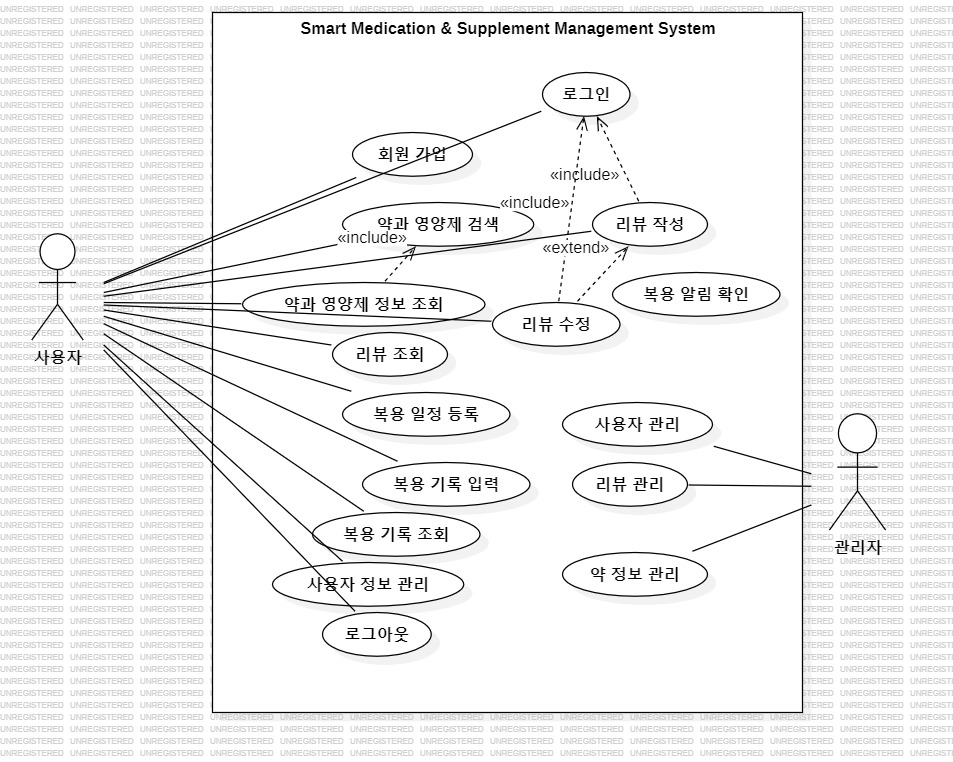
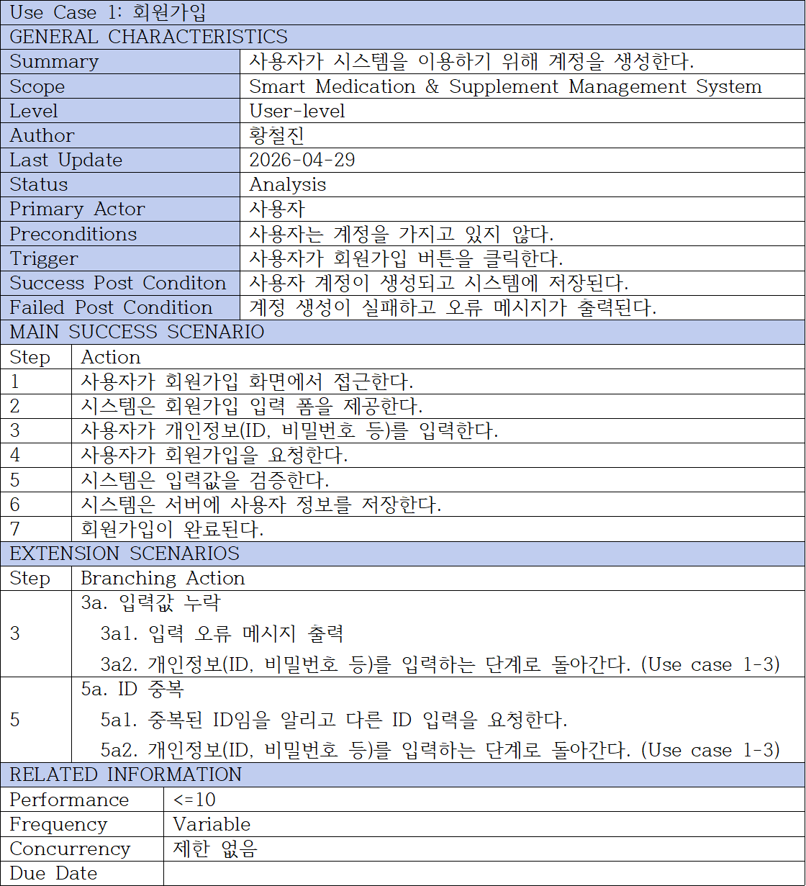
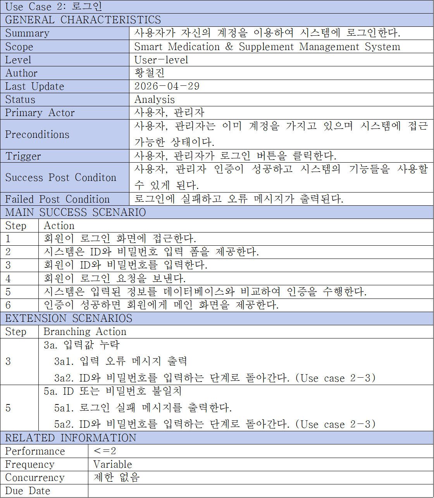
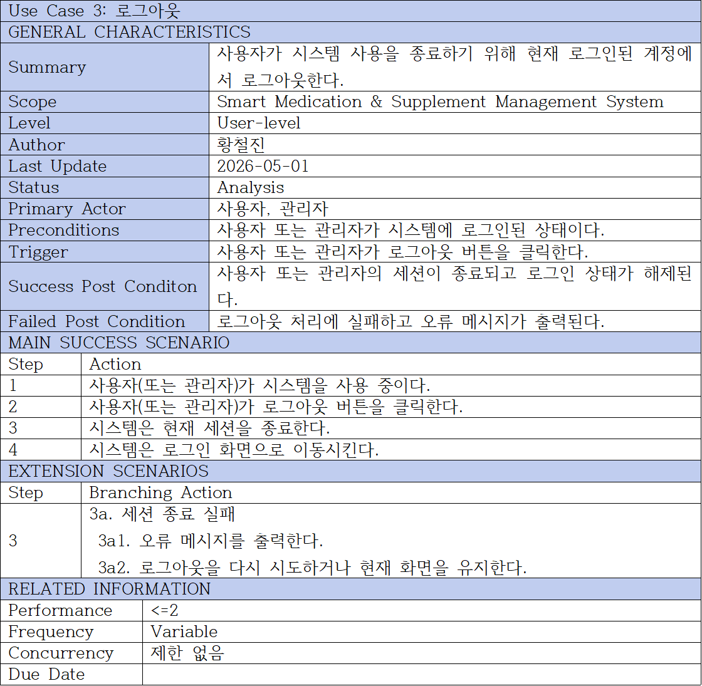

# Smart Medication & Supplement Management System
###### 
###### Analysis phase
| 학번 | 이름 | 이메일 |
| :---: | :---: | :---: |
| 22112024 | 황철진 | 5287246@naver.com |

# 1.Introduction
### 1) Summary

현대 사회에서는 여러 종류의 약과 영양제를 동시에 복용하는 경우가 많지만, 복용 시간이나 방법을 정확히 기억하지 못하거나 신뢰할 수 있는 정보를 얻기 어려운 문제가 존재한다. 이러한 문제는 복용 누락, 오용, 그리고 약물 간 상호작용으로 인한 부작용을 초래할 수 있다.

본 시스템은 이러한 문제를 해결하기 위해 복약 일정 관리, 복용 기록 저장, 약/영양제 정보 제공, 그리고 사용자 리뷰 기능을 통합한 플랫폼을 제공한다. 사용자는 복용 시간을 설정하고 알림을 받을 수 있으며, 복용 여부를 기록하여 자신의 복약 이력을 체계적으로 관리할 수 있다. 또한 약/영양제에 대한 상세 정보와 다른 사용자의 리뷰를 통해 보다 신뢰성 있는 의사결정을 할 수 있도록 지원한다.

더불어 관리자 기능을 통해 사용자 계정, 리뷰, 약 정보를 관리할 수 있어 시스템의 신뢰성과 안정성을 유지할 수 있도록 설계되었다. 본 시스템은 사용자 중심의 직관적인 인터페이스를 제공함으로써 복약 순응도를 높이고, 보다 체계적인 건강 관리 환경을 제공하는 것을 목표로 한다.

### 2) Describe the features of project
첫째, 유용성 측면에서 본 시스템은 사용자의 복약 관리 부담을 줄여준다. 복용 일정 알림과 기록 기능을 통해 사용자는 복약 시간을 놓치지 않고 꾸준히 관리할 수 있으며, 이는 실제 건강 관리에 직접적인 도움을 준다.

둘째, 중요성 측면에서 본 시스템은 안전한 복약 환경을 제공한다. 약물 정보와 사용자 리뷰를 함께 제공함으로써 사용자는 보다 신뢰성 있는 정보를 바탕으로 약을 복용할 수 있으며, 이는 부작용 및 오용을 예방하는 데 기여한다.

셋째, 확장성 측면에서 본 시스템은 다양한 기능 확장이 가능하다. 예를 들어 병원 시스템과의 연동, 개인 건강 데이터 분석, AI 기반 복약 추천 시스템 등으로 발전할 수 있으며, 모바일 환경을 기반으로 다양한 플랫폼에서도 활용될 수 있다.

또한 관리자 기능을 통해 사용자 및 콘텐츠를 효율적으로 관리할 수 있어 시스템의 지속적인 운영과 품질 유지가 가능하다. 이러한 점에서 본 시스템은 단순한 정보 제공을 넘어 종합적인 건강 관리 플랫폼으로 확장될 가능성을 가진다.

# 2. Use case analysis
## 1) Use case diagram
###### 

## 2)Use case description
###### 
###### 
###### 
###### 
###### 
###### 
###### 
###### 
###### 
# 3. Domain analysis

# 4. User Interface prototype

# 5. Glossary

# 6. References
