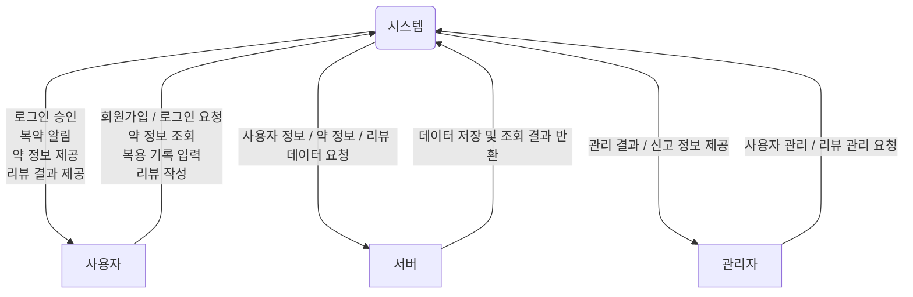

# Smart Medication & Supplement Management System
###### 
###### Conceptualization
| 학번 | 이름 | 이메일 |
| :---: | :---: | :---: |
| 22112024 | 황철진 | 5287246@naver.com |

  
# [ Revision history ]
| Revision date | Version | Description | Author |
| :---: | :---: | :---: | :---: |
| |1.0| first writing | |
| | | | |
| | | | |
| | | | |

# 1. Business purpose
  
Smart Medication & Supplement Management System의 목적은 사용자가 일상적으로 복용하는 의약품 및 영양제를 보다 안전하고 효율적으로 관리할 수 있도록 지원하는 것이다.
현대 사회에서 많은 사람들은 처방약, 일반의약품, 그리고 다양한 영양제를 함께 복용하고 있다. 그러나 복용 시간과 방법을 정확히 기억하지 못하거나, 제품에 대한 신뢰할 수 있는 정보를 얻기 어려운 경우가 많다. 이러한 문제는 복용 누락, 잘못된 복용 방법, 그리고 부작용이나 약물 간 상호작용에 대한 인지 부족으로 이어질 수 있다.
본 시스템은 이러한 문제를 해결하기 위해 복약 일정 관리, 복용 기록 저장, 그리고 의약품 및 영양제에 대한 종합적인 정보 제공 기능을 통합한 플랫폼을 제공한다. 사용자는 정해진 시간에 알림을 받고 복용 여부를 기록할 수 있으며, 각 제품의 효능, 복용 방법, 주의사항 등의 정보를 쉽게 확인할 수 있다.
또한, 사용자 리뷰 기능을 통해 실제 복용 경험과 효과, 부작용 등에 대한 정보를 공유할 수 있도록 하여, 공식 정보뿐만 아니라 사용자 기반의 실질적인 정보를 함께 제공한다.
궁극적으로 본 시스템은 사용자의 복약 순응도를 향상시키고, 보다 안전한 복용 환경을 조성하며, 일상적인 건강 관리를 보다 편리하고 체계적으로 지원하는 것을 목표로 한다.

# 2. System context diagram

System : Smart Medication & Supplement Management System으로, 복약 관리, 정보 제공, 사용자 관리 등의 핵심 기능을 수행하는 중심 시스템이다.

Users : 시스템을 사용하는 일반 사용자로, 회원가입, 로그인, 약 정보 조회, 복용 기록 입력, 리뷰 작성 등의 기능을 수행한다.

Server (DB Server) : 사용자 정보, 약 정보, 리뷰 데이터를 저장하고 관리하는 외부 시스템으로, 시스템의 요청에 따라 데이터를 제공하거나 저장한다.

Administrator : 시스템을 관리하는 주체로, 사용자 관리 및 리뷰 관리 등의 관리 기능을 수행한다.

# 3. Use case list
| No | Use Case              | Actor              | Description |
|----|----------------------|--------------------|-------------|
| 1  | 회원가입             | Users              | 리뷰 등록 시스템의 기능을 이용하기 위해 회원가입을 진행한다. |
| 2  | 로그인               | Users              | 자신의 계정으로 로그인하며, 시스템은 서버를 통해 로그인 성공 여부를 확인한다. |
| 3  | 로그아웃             | Users              | 시스템 사용 종료 시 로그아웃을 수행한다. |
| 4  | 약/영양제 검색        | Users              | 약 또는 영양제의 이름을 검색하여 관련 정보를 조회한다. |
| 5  | 약/영양제 정보 조회   | Users              | 선택한 약/영양제의 효능, 복용법, 주의사항 등의 상세 정보를 확인한다. |
| 6  | 복약 일정 등록        | Users              | 복용할 약/영양제의 복용 시간 및 주기를 등록한다. |
| 7  | 복용 알림 확인        | Users              | 시스템이 제공하는 복용 알림을 확인한다. |
| 8  | 복용 기록 입력        | Users              | 약/영양제 복용 여부를 기록한다. |
| 9  | 복용 기록 조회        | Users              | 자신의 복약 이력을 조회한다. |
| 10 | 리뷰 조회            | Users              | 유저는 다른 사용자가 작성한 약/영양제 리뷰를 조회한다. |
| 11 | 리뷰 작성            | Users              | 유저는 약/영양제에 대한 자신의 경험을 바탕으로 리뷰를 작성한다. |
| 12 | 리뷰 수정/삭제        | Users              | 자신이 작성한 리뷰를 수정하거나 삭제한다. |
| 13 | 사용자 정보 관리      | Users              | 자신의 계정 정보를 수정하거나 관리한다. |
| 14 | 사용자 관리          | Administrator      | 관리자는 사용자 계정을 조회, 수정 또는 삭제할 수 있다. |
| 15 | 리뷰 관리            | Administrator      | 관리자는 부적절한 리뷰를 검토하고 삭제할 수 있다. |
| 16 | 약 정보 관리         | Administrator      | 관리자는 약/영양제 정보를 추가, 수정, 삭제할 수 있다. |

# 4. Concept of operation
1. 회원가입
<table>
  <tr>
    <td><b>Purpose</b></td>
    <td>리뷰 등록 시스템의 기능을 이용하기 위해 사용자 식별이 가능한 계정이 필요함.</td>
  </tr>
  <tr>
    <td><b>Approach</b></td>
    <td>
      회원가입 화면을 제공하여 사용자로부터 기본 정보를 입력받아 계정을 생성한다.
    </td>
  </tr>
  <tr>
    <td><b>Dynamics</b></td>
    <td>사용자가 처음 시스템을 이용하거나 계정이 없는 경우</td>
  </tr>
  <tr>
    <td><b>Goals</b></td>
    <td>사용자가 계정을 생성할 수 있는 기능을 구현함</td>
  </tr>
</table>

2. 로그인
<table>
  <tr>
    <td><b>Purpose</b></td>
    <td>사용자의 식별을 통해 개인화된 서비스 제공이 가능하도록 한다.
  </tr>
  <tr> 
    <td><b>Approach</b></td>
    <td>사용자가 입력한 계정 정보를 서버와 비교하여 로그인 여부를 판단한다.
  </tr>
  <tr>
    <td><b>Dynamics</b></td>
    <td>사용자가 시스템에 접근할 때
  </tr>
  <tr>
  <tr>
    <td><b>Goals</b></td>
    <td>정확한 사용자 인증 기능을 구현한다.
 </tr>
</table>

3. 약/영양제 검색
<table>
  <tr>
    <td><b>Purpose</b></td>
    <td>사용자가 원하는 약 또는 영양제 정보를 쉽게 찾을 수 있도록 한다.
  </tr>
  <tr> 
    <td><b>Approach</b></td>
    <td>검색 기능을 통해 키워드를 입력하면 관련 정보를 제공한다.
  </tr>
  <tr>
    <td><b>Dynamics</b></td>
    <td>특정 약 또는 영양제 정보를 찾고 싶을 경우
  </tr>
  <tr>
  <tr>
    <td><b>Goals</b></td>
    <td>빠르고 정확한 검색 기능을 제공한다.
 </tr>
</table>

4. 약/영양제 정보 조회
<table>
  <tr>
    <td><b>Purpose</b></td>
    <td>사용자가 약의 효능, 복용법, 주의사항 등을 정확히 이해할 수 있도록 한다.
  </tr>
  <tr> 
    <td><b>Approach</b></td>
    <td>선택된 약/영양제의 상세 정보를 화면에 제공한다.
  </tr>
  <tr>
    <td><b>Dynamics</b></td>
    <td>약/영양제의 상세 정보를 확인하고 싶을 경우
  </tr>
  <tr>
  <tr>
    <td><b>Goals</b></td>
    <td>신뢰성 있는 정보를 제공하는 기능을 구현한다.
 </tr>
</table>

5. 복약 일정 등록
<table>
  <tr>
    <td><b>Purpose</b></td>
    <td>사용자가 약 복용 시간을 체계적으로 관리할 수 있도록 한다.
  </tr>
  <tr> 
    <td><b>Approach</b></td>
    <td>복용 시간 및 주기를 설정할 수 있는 인터페이스를 제공한다.
  </tr>
  <tr>
    <td><b>Dynamics</b></td>
    <td>정기적인 약 복용이 필요한 경우
  </tr>
  <tr>
  <tr>
    <td><b>Goals</b></td>
    <td>복약 일정 관리 기능을 구현한다.
 </tr>
</table>

6. 복용 알림
<table>
  <tr>
    <td><b>Purpose</b></td>
    <td>사용자가 약 복용 시간을 놓치지 않도록 한다.
  </tr>
  <tr> 
    <td><b>Approach</b></td>
    <td>설정된 시간에 알림을 발생시켜 사용자에게 전달한다.
  </tr>
  <tr>
    <td><b>Dynamics</b></td>
    <td>설정된 복용 시간이 도래했을 때
  </tr>
  <tr>
  <tr>
    <td><b>Goals</b></td>
    <td>정확한 타이밍에 알림을 제공하는 기능을 구현한다.
 </tr>
</table>

7. 복용 기록 입력
<table>
  <tr>
    <td><b>Purpose</b></td>
    <td>사용자의 복약 이력을 관리하여 복용 여부를 확인할 수 있도록 한다.
  </tr>
  <tr> 
    <td><b>Approach</b></td>
    <td>사용자가 버튼 클릭을 통해 복용 여부를 기록하도록 한다.
  </tr>
  <tr>
    <td><b>Dynamics</b></td>
    <td>약을 복용한 직후
  </tr>
  <tr>
  <tr>
    <td><b>Goals</b></td>
    <td>간편한 기록 기능을 제공한다.
 </tr>
</table>

8. 복용 기록 조회
<table>
  <tr>
    <td><b>Purpose</b></td>
    <td>사용자가 자신의 약, 영양제등의 복약 패턴을 확인할 수 있도록 한다.
  </tr>
  <tr> 
    <td><b>Approach</b></td>
    <td>이전 복용 기록을 리스트 형태로 제공한다.
  </tr>
  <tr>
    <td><b>Dynamics</b></td>
    <td>복용 이력을 확인하고 싶을 때
  </tr>
  <tr>
  <tr>
    <td><b>Goals</b></td>
    <td>복약 이력 조회 기능을 구현한다.
 </tr>
</table>

9. 리뷰 조회
<table>
  <tr>
    <td><b>Purpose</b></td>
    <td>다른 사용자의 경험을 참고할 수 있도록 한다.
  </tr>
  <tr> 
    <td><b>Approach</b></td>
    <td>서버에 저장된 리뷰 데이터를 불러와 사용자에게 제공한다.
  </tr>
  <tr>
    <td><b>Dynamics</b></td>
    <td>약/영양제에 대한 평가를 확인하고 싶을 때
  </tr>
  <tr>
  <tr>
    <td><b>Goals</b></td>
    <td>리뷰 조회 기능을 구현한다.
 </tr>
</table>
10. 리뷰 작성
<table>
  <tr>
    <td><b>Purpose</b></td>
    <td>사용자의 경험을 공유하여 다른 사용자에게 도움을 준다.
  </tr>
  <tr> 
    <td><b>Approach</b></td>
    <td>별점 및 텍스트 입력을 통해 리뷰를 작성하고 서버에 저장한다.
  </tr>
  <tr>
    <td><b>Dynamics</b></td>
    <td>약/영양제를 복용한 후
  </tr>
  <tr>
  <tr>
    <td><b>Goals</b></td>
    <td>리뷰 작성 기능을 구현한다.
 </tr>
</table>

11. 사용자 관리
<table>
  <tr>
    <td><b>Purpose</b></td>
    <td>시스템의 안정적인 운영을 위해 사용자 관리를 수행한다.
  </tr>
  <tr> 
    <td><b>Approach</b></td>
    <td>관리자가 사용자를 밴하거나 삭제할 수 있도록 한다.
  </tr>
  <tr>
    <td><b>Dynamics</b></td>
    <td>관리자가 시스템을 관리할 때
  </tr>
  <tr>
  <tr>
    <td><b>Goals</b></td>
    <td>효율적인 사용자 관리 기능을 구현한다.
 </tr>
</table>

12. 리뷰 관리
<table>
  <tr>
    <td><b>Purpose</b></td>
    <td>부적절한 리뷰를 제거하여 시스템의 신뢰성을 유지한다.
  </tr>
  <tr> 
    <td><b>Approach</b></td>
    <td>관리자가 리뷰를 검토하고 삭제할 수 있도록 한다.
  </tr>
  <tr>
    <td><b>Dynamics</b></td>
    <td>부적절한 리뷰가 발견되었을 때
  </tr>
  <tr>
  <tr>
    <td><b>Goals</b></td>
    <td>리뷰 관리 기능을 구현한다.
 </tr>
</table>

13. 약 정보 관리
<table>
  <tr>
    <td><b>Purpose</b></td>
    <td>정확하고 최신의 약/영양제 정보를 유지한다.
  </tr>
  <tr> 
    <td><b>Approach</b></td>
    <td>관리자가 약 정보를 추가, 수정, 삭제할 수 있도록 한다.
  </tr>
  <tr>
    <td><b>Dynamics</b></td>
    <td>약 정보 업데이트가 필요할 때
  </tr>
  <tr>
  <tr>
    <td><b>Goals</b></td>
    <td>약 정보 관리 기능을 구현한다.
 </tr>
</table>

# 5. Problem statement

# 6. Glossary

# 7. References
