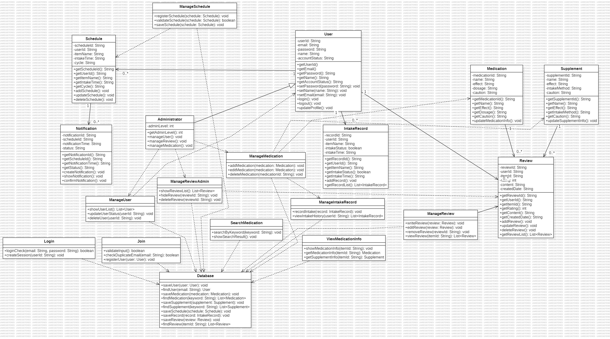
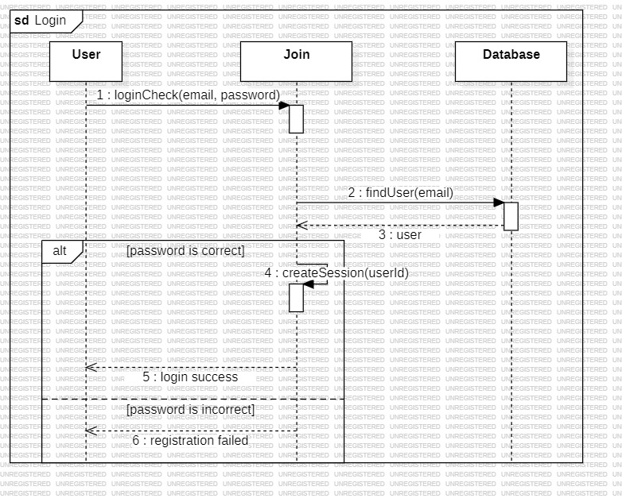
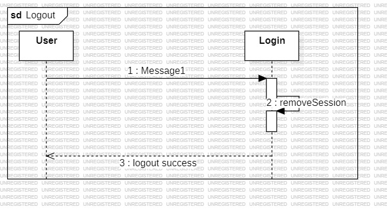

# Smart Medication & Supplement Management System
###### 
###### Design phase
| 학번 | 이름 | 이메일 |
| :---: | :---: | :---: |
| 22112024 | 황철진 | 5287246@naver.com |

# [ Revision history ]
| Revision date | Version | Description | Author |
| :---: | :---: | :---: | :---: |
| 2026-06-02 | 1.0.0 | first writing | 황철진 |
| | | | |
| | | | |
| | | | |

# 1.Introduction
현대 사회에서는 다양한 종류의 약과 영양제를 동시에 복용하는 사람들이 증가하고 있다. 특히 만성 질환 관리, 건강 유지, 면역력 강화 등의 목적으로 여러 제품을 함께 복용하는 경우가 많아지면서 복용 시간과 복용 방법을 정확하게 관리하는 것이 중요해지고 있다. 그러나 사용자는 복용 시간을 잊어버리거나 복용 여부를 정확히 기억하지 못하는 경우가 많으며, 약과 영양제에 대한 신뢰성 있는 정보를 얻기 어려운 문제 또한 존재한다. 이러한 문제는 복용 누락, 잘못된 복용 방법, 약물 간 상호작용, 그리고 부작용과 같은 위험으로 이어질 수 있다.
본 프로젝트인 Smart Medication & Supplement Management System은 이러한 문제를 해결하기 위해 설계된 통합 복약 관리 시스템이다. 본 시스템은 사용자가 약과 영양제의 복용 일정을 등록하고, 설정된 시간에 복용 알림을 받을 수 있도록 지원한다. 또한 사용자는 실제 복용 여부를 기록하고 자신의 복약 이력을 조회할 수 있으며, 이를 통해 보다 체계적이고 지속적인 건강 관리를 수행할 수 있다.
추가적으로 본 시스템은 약/영양제 검색 기능과 상세 정보 조회 기능을 제공한다. 사용자는 약 또는 영양제의 효능, 복용 방법, 주의사항 등의 정보를 쉽게 확인할 수 있으며, 사용자 리뷰 기능을 통해 실제 복용 경험과 평가를 함께 참고할 수 있다. 이를 통해 공식 정보뿐만 아니라 사용자 기반의 실질적인 정보를 함께 제공하여 보다 신뢰성 있는 복약 환경을 제공하는 것을 목표로 한다.
또한 시스템의 신뢰성과 안정성을 유지하기 위해 관리자 기능을 제공한다. 관리자는 사용자 계정 관리, 리뷰 관리, 약/영양제 정보 관리 기능을 수행할 수 있으며, 이를 통해 부적절한 리뷰를 관리하고 최신의 정확한 약 정보를 유지할 수 있도록 설계하였다.
본 문서는 Smart Medication & Supplement Management System 개발 과정 중 Design 단계에 대한 내용을 다룬다. 본 단계에서는 Analysis 단계에서 정의한 요구사항과 기능들을 기반으로 시스템의 내부 구조와 동작 방식을 구체적으로 설계한다. 이를 위해 Class Diagram, Sequence Diagram, State Machine Diagram 등을 사용하여 시스템의 구조와 객체 간의 관계, 기능 수행 흐름을 시각적으로 표현하였다. 또한 실제 구현 과정에서 필요한 주요 설계 요소와 시스템 구조를 정의함으로써 구현 단계에서 일관성 있고 효율적인 개발이 가능하도록 하는 것을 목표로 한다.

# 2.Class diagram
###### 

### 1) User Class
| Type | Name | Description |
| --- | --- | --- |
| Attribute | - userId: String | 사용자를 고유하게 식별하기 위한 ID이다. 복약 일정, 복용 기록, 리뷰 등 사용자별 데이터를 구분할 때 사용된다. |
| Attribute | - email: String | 사용자의 이메일 정보이다. 로그인 시 계정 식별 정보로 사용되며, 회원가입 중복 확인에도 사용된다. |
| Attribute | - password: String | 사용자의 비밀번호 정보이다. 로그인 인증 과정에서 입력된 비밀번호와 비교하는 데 사용된다. |
| Attribute | - name: String | 사용자의 이름 정보이다. 사용자 정보 관리 화면이나 개인화된 서비스 제공에 사용된다. |
| Attribute | - accountStatus: String | 사용자의 계정 상태를 나타낸다. 정상, 정지, 탈퇴 등의 상태를 구분하여 시스템 접근 가능 여부를 판단하는 데 사용된다. |
| Method | + getUserId(): String | 사용자의 고유 ID를 반환한다. 다른 클래스에서 특정 사용자의 일정, 기록, 리뷰 정보를 조회할 때 사용된다.  |
| Method | + getEmail(): String | 사용자의 이메일 정보를 반환한다. 로그인, 계정 확인, 사용자 정보 조회 과정에서 사용된다. |
| Method | + getPassword(): String | 사용자의 비밀번호 정보를 반환한다. 로그인 검증 과정에서 입력된 비밀번호와 비교하기 위해 사용된다. |
| Method | + getName(): String | 사용자의 이름을 반환한다. 화면 출력이나 사용자 정보 확인 과정에서 사용된다. |
| Method | + getAccountStatus(): String | 사용자의 계정 상태를 반환한다. 계정이 정상 상태인지, 정지 상태인지 확인할 때 사용된다. |
| Method | + setPassword(password: String): void | 사용자의 비밀번호를 변경한다. 사용자 정보 관리 기능에서 비밀번호 수정 시 사용된다. |
| Method | + setName(name: String): void | 사용자의 이름을 변경한다. 사용자가 자신의 개인정보를 수정할 때 사용된다. |
| Method | + setEmail(email: String): void | 사용자의 이메일을 변경한다. 계정 정보 수정 과정에서 사용된다. |
| Method | + login(): void | 사용자가 시스템에 접근하기 위해 로그인 기능을 수행한다. |
| Method | + logout(): void | 사용자의 로그인 상태를 해제하고 시스템 사용을 종료한다. |
| Method | + updateProfile(): void | 사용자의 이름, 이메일, 비밀번호 등 계정 정보를 수정하는 기능을 수행한다. |
| Others | Relationship | Administrator 클래스의 상위 클래스이다. 또한 Schedule, IntakeRecord, Review 클래스와 연관 관계를 가지며, 한 명의 사용자는 여러 개의 복약 일정, 복용 기록, 리뷰를 가질 수 있다. |

### 2) Administrator Class
| Type | Name | Description |
| --- | --- | --- |
| Attribute | - adminLevel: int | 관리자의 권한 수준을 저장하는 속성이다. 일반 관리자와 최고 관리자 등을 구분할 때 사용될 수 있으며, 접근 가능한 관리 기능을 판단하는 데 사용된다. |
| Method | + getAdminLevel(): int | 관리자의 권한 수준 정보를 반환한다. 시스템에서 관리자 권한 검증 및 기능 접근 제어에 사용된다. |
| Method | + manageUser(): void | 사용자 관리 기능을 수행한다. 사용자 목록 조회, 계정 상태 변경, 계정 삭제 등의 기능을 처리할 때 사용된다. |
| Method | + manageReview(): void | 리뷰 관리 기능을 수행한다. 부적절하거나 신고된 리뷰를 검토하고 숨김 또는 삭제 처리할 때 사용된다. |
| Method | + manageMedication(): void | 약/영양제 정보 관리 기능을 수행한다. 약 또는 영양제 정보를 추가, 수정, 삭제하는 기능을 처리할 때 사용된다. |
| Others | Relationship | User 클래스를 상속받는 하위 클래스이다. 또한 ManageUser, ManageReviewAdmin, ManageMedication 클래스와 의존 관계를 가지며 시스템 관리 기능을 수행한다. |

### 3) Medication Class
| Type | Name | Description |
| --- | --- | --- |
| Attribute | - medicationId: String | 시스템에 등록된 의약품을 고유하게 식별하기 위한 ID이다. 약 정보 조회 및 리뷰 관리 과정에서 특정 의약품을 구분하는 데 사용된다. |
| Attribute | - name: String | 의약품의 이름을 저장하는 속성이다. 검색 기능이나 상세 정보 조회 화면에서 사용자에게 표시된다. |
| Attribute | - effect: String | 의약품의 효능 및 치료 효과 정보를 저장하는 속성이다. 사용자가 약의 목적과 기능을 확인할 때 사용된다. |
| Attribute | - dosage: String | 의약품의 복용 방법 및 권장 복용량 정보를 저장하는 속성이다. 복용 횟수, 복용 시간, 1회 복용량 등의 정보를 포함할 수 있다. |
| Attribute | - caution: String | 의약품 복용 시 주의사항 정보를 저장하는 속성이다. 부작용, 약물 상호작용, 특정 질환 환자의 복용 제한 등의 정보를 포함한다. |
| Method | + getMedicationId(): String | 의약품의 고유 ID를 반환한다. 특정 약 정보를 조회하거나 리뷰와 연결할 때 사용된다. |
| Method | + getName(): String | 의약품의 이름 정보를 반환한다. 검색 결과 및 상세 정보 화면 출력에 사용된다. |
| Method | + getEffect(): String | 의약품의 효능 정보를 반환한다. 사용자가 약의 효과를 확인할 때 사용된다. |
| Method | + getDosage(): String | 의약품의 복용 방법 및 복용량 정보를 반환한다. 사용자가 올바른 복용 방법을 확인할 때 사용된다. |
| Method | + getCaution(): String | 의약품 복용 시 주의사항 정보를 반환한다. 사용자가 부작용 및 복용 시 주의 내용을 확인할 때 사용된다. |
| Method | + updateMedicationInfo(): void | 의약품 정보를 수정하거나 업데이트하는 기능을 수행한다. 관리자가 약 정보를 추가 또는 수정할 때 사용된다. |
| Others | Relationship | Review 클래스와 연관 관계를 가진다. 하나의 의약품은 여러 개의 사용자 리뷰를 가질 수 있으며, ManageMedication 클래스와 의존 관계를 통해 관리자에 의해 관리된다. |

### 4) Supplement Class
| Type | Name | Description |
| --- | --- | --- |
| Attribute | - supplementId: String | 시스템에 등록된 영양제를 고유하게 식별하기 위한 ID이다. 영양제 정보 조회 및 리뷰 관리 과정에서 특정 영양제를 구분하는 데 사용된다. |
| Attribute | - name: String | 영양제의 이름을 저장하는 속성이다. 검색 기능이나 상세 정보 조회 화면에서 사용자에게 표시된다. |
| Attribute | - effect: String | 영양제의 주요 효과 및 기능 정보를 저장하는 속성이다. 사용자가 영양제의 효능을 확인할 때 사용된다. |
| Attribute | - intakeMethod: String | 영양제의 섭취 방법 및 복용 방법 정보를 저장하는 속성이다. 복용 시간, 권장 섭취량 등의 정보를 포함할 수 있다. |
| Attribute | - caution: String | 영양제 복용 시 주의사항 정보를 저장하는 속성이다. 부작용, 과다 복용 위험, 특정 상황에서의 주의 내용 등을 포함한다. |
| Method | + getSupplementId(): String | 영양제의 고유 ID를 반환한다. 특정 영양제 정보를 조회하거나 리뷰와 연결할 때 사용된다. |
| Method | + getName(): String | 영양제의 이름 정보를 반환한다. 검색 결과 및 상세 정보 화면 출력에 사용된다. |
| Method | + getEffect(): String | 영양제의 효과 정보를 반환한다. 사용자가 영양제의 효능을 확인할 때 사용된다. |
| Method | + getIntakeMethod(): String | 영양제의 섭취 방법 정보를 반환한다. 사용자가 올바른 복용 방법을 확인할 때 사용된다. |
| Method | + getCaution(): String | 영양제 복용 시 주의사항 정보를 반환한다. 사용자가 부작용이나 복용 시 주의 내용을 확인할 때 사용된다. |
| Method | + updateSupplementInfo(): void | 영양제 정보를 수정하거나 업데이트하는 기능을 수행한다. 관리자가 영양제 정보를 변경할 때 사용된다. |
| Others | Relationship | Review 클래스와 연관 관계를 가진다. 하나의 영양제는 여러 개의 사용자 리뷰를 가질 수 있으며, ManageMedication 클래스와 의존 관계를 통해 관리자에 의해 관리된다. |

### 5) Schedule Class
| Type | Name | Description |
| --- | --- | --- |
| Attribute | - scheduleId: String | 복약 일정을 고유하게 식별하기 위한 ID이다. 사용자가 등록한 여러 일정들을 구분하고 관리할 때 사용된다. |
| Attribute | - userId: String | 해당 복약 일정을 등록한 사용자의 ID이다. 특정 사용자의 복약 일정 데이터를 조회하거나 관리할 때 사용된다. |
| Attribute | - itemName: String | 복용 대상인 약 또는 영양제의 이름을 저장하는 속성이다. 사용자가 어떤 제품을 복용해야 하는지 표시할 때 사용된다. |
| Attribute | - intakeTime: String | 사용자가 설정한 복용 시간을 저장하는 속성이다. 시스템은 해당 시간을 기준으로 복용 알림을 생성한다. |
| Attribute | - cycle: String | 복용 주기를 저장하는 속성이다. 하루 1회, 하루 3회, 매주 등 반복 복용 규칙을 설정할 때 사용된다. |
| Method | + getScheduleId(): String | 복약 일정의 고유 ID를 반환한다. 특정 일정을 조회하거나 수정할 때 사용된다. |
| Method | + getUserId(): String | 해당 일정을 등록한 사용자의 ID를 반환한다. 사용자별 복약 일정을 관리할 때 사용된다. |
| Method | + getItemName(): String | 복용 대상 약 또는 영양제의 이름을 반환한다. 일정 목록 및 알림 화면 출력에 사용된다. |
| Method | + getIntakeTime(): String | 사용자가 설정한 복용 시간을 반환한다. 알림 생성 및 일정 조회 기능에서 사용된다. |
| Method | + getCycle(): String | 사용자가 설정한 복용 주기 정보를 반환한다. 반복 복약 일정 관리에 사용된다. |
| Method | + addSchedule(): void | 새로운 복약 일정을 등록하는 기능을 수행한다. 사용자가 입력한 일정 정보를 시스템에 저장할 때 사용된다. |
| Method | + updateSchedule(): void | 기존 복약 일정을 수정하는 기능을 수행한다. 복용 시간이나 주기 변경 시 사용된다. |
| Method | + deleteSchedule(): void | 등록된 복약 일정을 삭제하는 기능을 수행한다. 사용자가 더 이상 필요하지 않은 일정을 제거할 때 사용된다. |
| Others | Relationship | User 클래스와 연관 관계를 가지며, 한 명의 사용자는 여러 개의 복약 일정을 가질 수 있다. 또한 Notification 클래스와 연관 관계를 가지며, 하나의 복약 일정은 여러 개의 복용 알림을 생성할 수 있다. ManageSchedule 클래스와 의존 관계를 통해 일정 등록 및 관리 기능이 수행된다. |

### 6) Notification Class
| Type | Name | Description |
| --- | --- | --- |
| Attribute | - notificationId: String | 알림을 고유하게 식별하기 위한 ID이다. 여러 개의 복용 알림이 생성될 때 각 알림을 구분하는 데 사용된다. |
| Attribute | - scheduleId: String | 알림이 연결된 복약 일정의 ID이다. 특정 복약 일정에 따라 어떤 알림이 생성되었는지 확인할 때 사용된다. |
| Attribute | - notificationTime: String | 알림이 사용자에게 표시되는 시간을 나타낸다. 사용자가 등록한 복약 시간에 맞추어 알림을 발생시키는 기준이 된다. |
| Attribute | - status: String | 알림의 현재 상태를 나타낸다. 예를 들어 대기, 표시됨, 확인 완료 등의 상태를 구분하여 알림 처리 여부를 관리한다. |
| Method | + getNotificationId(): String | 알림의 고유 ID를 반환한다. 특정 알림을 조회하거나 관리할 때 사용된다. |
| Method | + getScheduleId(): String | 해당 알림과 연결된 복약 일정 ID를 반환한다. 알림이 어떤 복약 일정에서 생성되었는지 확인할 때 사용된다. |
| Method | + getNotificationTime(): String | 알림이 발생해야 하는 시간을 반환한다. 시스템이 현재 시간과 비교하여 알림 표시 여부를 판단할 때 사용된다. |
| Method | + getStatus(): String | 알림의 현재 상태를 반환한다. 사용자가 알림을 확인했는지 또는 아직 확인하지 않았는지 판단할 때 사용된다. |
| Method | + createNotification(): void | 복약 일정 정보를 바탕으로 새로운 알림을 생성한다. 등록된 복약 시간이 도래했을 때 사용자에게 알림을 제공하기 위해 사용된다. |
| Method | + showNotification(): void | 생성된 알림을 사용자 화면 또는 기기 알림 영역에 표시한다. 사용자가 복용 시간을 놓치지 않도록 안내하는 역할을 한다. |
| Method | + confirmNotification(): void | 사용자가 알림을 확인했을 때 알림 상태를 확인 완료로 변경한다. 이후 복용 기록 입력 또는 알림 목록 관리에 활용된다. |
| Others | Relationship | Schedule 클래스와 연관 관계를 가진다. 하나의 복약 일정은 여러 개의 알림을 생성할 수 있으며, Notification은 특정 복약 일정에 의해 발생하는 알림 정보를 관리한다. |

### 7) IntakeRecord Class
| Type | Name | Description |
| --- | --- | --- |
| Attribute | - recordId: String | 복용 기록을 고유하게 식별하기 위한 ID이다. 각 복용 기록 데이터를 구분하고 관리할 때 사용된다. |
| Attribute | - userId: String | 복용 기록을 등록한 사용자의 ID이다. 어떤 사용자의 복용 기록인지 확인하기 위해 사용된다. |
| Attribute | - medicationName: String | 사용자가 복용한 약 또는 영양제의 이름이다. 복용한 제품 정보를 저장하고 조회할 때 사용된다. |
| Attribute | - intakeTime: String | 사용자가 실제로 약 또는 영양제를 복용한 시간을 저장한다. 복약 이력을 시간 순으로 관리할 때 사용된다. |
| Attribute | - intakeStatus: boolean | 사용자의 복용 여부를 나타낸다. true는 복용 완료, false는 미복용 상태를 의미한다. |
| Method | + getRecordId(): String | 복용 기록의 고유 ID를 반환한다. 특정 복용 기록을 조회하거나 수정할 때 사용된다. |
| Method | + getUserId(): String | 복용 기록을 등록한 사용자의 ID를 반환한다. 사용자별 복약 이력을 조회할 때 사용된다. |
| Method | + getMedicationName(): String | 복용한 약 또는 영양제의 이름을 반환한다. 어떤 제품을 복용했는지 확인할 때 사용된다. |
| Method | + getIntakeTime(): String | 사용자가 복용한 시간을 반환한다. 복약 시간 분석 및 이력 관리에 활용된다. |
| Method | + getIntakeStatus(): boolean | 복용 여부 상태를 반환한다. 사용자가 약을 복용했는지 확인할 때 사용된다. |
| Method | + saveRecord(): void | 사용자의 복용 기록 정보를 시스템에 저장한다. 사용자가 복용 완료 버튼을 눌렀을 때 실행된다. |
| Method | + viewRecord(): void | 저장된 복용 기록 정보를 조회한다. 사용자가 자신의 복약 이력을 확인할 때 사용된다. |
| Method | + updateRecord(): void | 기존 복용 기록 정보를 수정한다. 잘못 입력된 복용 시간이나 상태를 변경할 때 사용된다. |
| Method | + deleteRecord(): void | 저장된 복용 기록을 삭제한다. 사용자가 불필요하거나 잘못된 기록을 제거할 때 사용된다. |
| Others | Relationship | User 클래스와 연관 관계를 가진다. 하나의 사용자는 여러 개의 복용 기록을 가질 수 있으며, IntakeRecord 클래스는 사용자의 복약 이력을 관리한다. 또한 Medication 및 Supplement 클래스와 연관 관계를 가진다. |

### 8) Review Class
| Type | Name | Description |
| --- | --- | --- |
| Attribute | - reviewId: String | 리뷰를 고유하게 식별하기 위한 ID이다. 각 리뷰 데이터를 구분하고 관리할 때 사용된다. |
| Attribute | - userId: String | 리뷰를 작성한 사용자의 ID이다. 어떤 사용자가 리뷰를 작성했는지 확인할 때 사용된다. |
| Attribute | - itemId: String | 리뷰 대상이 되는 약 또는 영양제의 ID이다. 특정 약/영양제와 연결된 리뷰를 조회할 때 사용된다. |
| Attribute | - rating: int | 사용자가 입력한 평점 정보이다. 약 또는 영양제에 대한 만족도를 수치 형태로 표현하는 데 사용된다. |
| Attribute | - content: String | 사용자가 작성한 리뷰 내용이다. 복용 경험, 효과, 부작용 등의 의견을 저장한다. |
| Attribute | - createdDate: String | 리뷰가 작성된 날짜 또는 시간을 저장한다. 리뷰 작성 시점을 확인하거나 최신 리뷰를 정렬할 때 사용된다. |
| Method | + getReviewId(): String | 리뷰의 고유 ID를 반환한다. 특정 리뷰를 조회하거나 관리할 때 사용된다. |
| Method | + getUserId(): String | 리뷰를 작성한 사용자의 ID를 반환한다. 사용자별 리뷰를 조회할 때 사용된다. |
| Method | + getItemId(): String | 리뷰 대상이 되는 약 또는 영양제의 ID를 반환한다. 특정 제품과 연결된 리뷰를 조회할 때 사용된다. |
| Method | + getRating(): int | 사용자가 입력한 평점 정보를 반환한다. 평균 평점 계산이나 리뷰 목록 출력에 사용된다. |
| Method | + getContent(): String | 리뷰 내용을 반환한다. 사용자가 작성한 상세 리뷰 정보를 화면에 표시할 때 사용된다. |
| Method | + getCreatedDate(): String | 리뷰 작성 날짜 정보를 반환한다. 리뷰 정렬 및 작성 시점 확인에 사용된다. |
| Method | + addReview(): void | 새로운 리뷰를 작성하고 시스템에 저장한다. 사용자가 리뷰 작성 기능을 수행할 때 사용된다. |
| Method | + updateReview(): void | 기존 리뷰 내용을 수정한다. 사용자가 자신의 리뷰 내용을 변경할 때 사용된다. |
| Method | + deleteReview(): void | 저장된 리뷰를 삭제한다. 사용자가 자신의 리뷰를 제거하거나 관리자가 부적절한 리뷰를 삭제할 때 사용된다. |
| Method | + getReviewList(): List<Review> | 특정 약 또는 영양제에 대한 리뷰 목록을 조회한다. 사용자에게 여러 리뷰를 출력할 때 사용된다. |
| Others | Relationship | User 클래스와 연관 관계를 가지며, 하나의 사용자는 여러 개의 리뷰를 작성할 수 있다. 또한 Medication 및 Supplement 클래스와 연관 관계를 가지며, 특정 약 또는 영양제에 대해 여러 개의 리뷰가 등록될 수 있다. ManageReview 및 ManageReviewAdmin 클래스에서 리뷰 관리 기능을 수행할 때 사용된다. |

### 9) Database Class
| Type | Name | Description |
| --- | --- | --- |
| Method | + saveUser(user: User): void | 회원가입 또는 사용자 정보 수정 시 User 객체를 데이터베이스에 저장한다. |
| Method | + findUser(email: String): User | 이메일을 기준으로 사용자 정보를 조회한다. 로그인 인증, 이메일 중복 확인, 사용자 정보 관리 기능에서 사용된다. |
| Method | + saveMedication(medication: Medication): void | 새로 추가되거나 수정된 약 정보를 데이터베이스에 저장한다. 관리자의 약 정보 관리 기능에서 사용된다. |
| Method | + findMedication(keyword: String): List<Medication> | 사용자가 입력한 검색어를 기준으로 약 정보를 조회한다. 약/영양제 검색 기능에서 약 목록을 제공할 때 사용된다. |
| Method | + saveSupplement(supplement: Supplement): void | 새로 추가되거나 수정된 영양제 정보를 데이터베이스에 저장한다. 관리자의 약/영양제 정보 관리 기능에서 사용된다. |
| Method | + findSupplement(keyword: String): List<Supplement> | 사용자가 입력한 검색어를 기준으로 영양제 정보를 조회한다. 약/영양제 검색 기능에서 영양제 목록을 제공할 때 사용된다. |
| Method | + saveSchedule(schedule: Schedule): void | 사용자가 등록한 복약 일정을 데이터베이스에 저장한다. 복약 일정 등록 및 수정 기능에서 사용된다. |
| Method | + saveRecord(record: IntakeRecord): void | 사용자가 입력한 복용 기록을 데이터베이스에 저장한다. 복용 완료 여부와 복용 시간을 기록할 때 사용된다. |
| Method | + saveReview(review: Review): void | 사용자가 작성하거나 수정한 리뷰 정보를 데이터베이스에 저장한다. 리뷰 작성, 리뷰 수정 기능에서 사용된다. |
| Method | + findReview(itemId: String): List<Review> | 특정 약 또는 영양제의 ID를 기준으로 리뷰 목록을 조회한다. 리뷰 조회 기능에서 사용자에게 리뷰 목록을 제공할 때 사용된다. |
| Others | Role | Database 클래스는 시스템의 데이터 저장소 역할을 수행한다. 사용자 정보, 약/영양제 정보, 복약 일정, 복용 기록, 리뷰 데이터를 저장하고 조회하는 중심 클래스이다. |
| Others | Relationship | Login, Join, SearchMedication, ViewMedicationInfo, ManageSchedule, ManageIntakeRecord, ManageReview, ManageUser, ManageReviewAdmin, ManageMedication 클래스와 의존 관계를 가진다. 각 기능 클래스는 필요한 데이터를 저장하거나 조회하기 위해 Database 클래스의 메서드를 사용한다. |

### 10) Login Class
| Type | Name | Description |
| --- | --- | --- |
| Method | + loginCheck(email: String, password: String): boolean | 사용자가 입력한 이메일과 비밀번호가 데이터베이스에 저장된 계정 정보와 일치하는지 확인한다. 로그인 성공 여부를 true 또는 false로 반환한다. |
| Method | + createSession(userId: String): void | 로그인 인증이 성공한 사용자의 세션을 생성한다. 이후 사용자가 시스템 기능을 사용할 때 로그인 상태를 유지하기 위해 사용된다. |
| Others | Role | Login 클래스는 사용자와 관리자의 로그인 기능을 처리하는 제어 클래스이다. 입력된 계정 정보를 확인하고, 인증 성공 시 시스템 접근을 허용한다. |
| Others | Relationship | Database 클래스와 의존 관계를 가진다. 로그인 검증을 위해 Database의 findUser() 메서드를 사용하여 사용자 정보를 조회한다. |

### 11) Join Class
| Type | Name | Description |
| --- | --- | --- |
| Method | + validateInput(): boolean | 사용자가 회원가입 화면에 입력한 정보가 올바른 형식인지 검증한다. 이메일 형식, 비밀번호 길이, 필수 입력값 누락 여부 등을 확인하며, 정상 입력 시 true를 반환한다. |
| Method | + checkDuplicateEmail(email: String): boolean | 입력된 이메일이 이미 등록된 계정인지 확인한다. 중복된 이메일이 존재하지 않으면 회원가입이 가능하며, 중복 시 오류 메시지를 출력하기 위해 사용된다. |
| Method | + registerUser(user: User): void | 회원가입이 완료된 사용자의 정보를 시스템에 등록한다. 입력된 사용자 정보를 Database 클래스에 저장하여 새로운 계정을 생성한다. |
| Others | Role | Join 클래스는 회원가입 기능을 처리하는 제어 클래스이다. 사용자의 입력값 검증, 이메일 중복 확인, 사용자 정보 저장 등의 기능을 수행한다. |
| Others | Relationship | Database 클래스와 의존 관계를 가진다. 회원가입 과정에서 사용자 정보를 저장하고 중복 이메일을 확인하기 위해 Database 클래스의 메서드를 사용한다. 또한 User 클래스와 의존 관계를 가지며, 회원가입 시 생성된 사용자 객체를 등록하는 데 사용된다. |

### 12) SearchMedication Class
| Type | Name | Description |
| --- | --- | --- |
| Method | + searchByKeyword(keyword: String): void | 사용자가 입력한 키워드를 기준으로 약 또는 영양제 정보를 검색한다. 검색 결과는 이름, 효능, 관련 정보 등을 포함하여 조회된다. |
| Method | + showSearchResult(): void | 검색된 약/영양제 목록을 사용자 화면에 출력한다. 사용자가 원하는 항목을 선택할 수 있도록 검색 결과를 제공한다. |
| Others | Role | SearchMedication 클래스는 약 및 영양제 검색 기능을 처리하는 제어 클래스이다. 사용자가 입력한 키워드를 기반으로 관련 정보를 검색하고 결과를 화면에 제공하는 역할을 수행한다. |
| Others | Relationship | Database 클래스와 의존 관계를 가진다. 약/영양제 정보를 검색하기 위해 Database 클래스의 findMedication() 및 findSupplement() 메서드를 사용한다. 또한 Medication 및 Supplement 클래스와 의존 관계를 가진다. 검색 결과는 해당 클래스의 객체 정보를 기반으로 사용자에게 제공된다. |

### 13) ViewMedicationInfo Class
| Type | Name | Description |
| --- | --- | --- |
| Method | + showMedicationInfo(itemId: String): void | 사용자가 선택한 약 또는 영양제의 상세 정보를 화면에 출력한다. 효능, 복용 방법, 주의사항 등의 정보를 사용자에게 제공할 때 사용된다. |
| Method | + getMedicationInfo(itemId: String): Medication | 입력된 약 ID를 기준으로 해당 약의 상세 정보를 조회하고 Medication 객체 형태로 반환한다. 약 정보 조회 기능에서 사용된다. |
| Method | + getSupplementInfo(itemId: String): Supplement | 입력된 영양제 ID를 기준으로 해당 영양제의 상세 정보를 조회하고 Supplement 객체 형태로 반환한다. 영양제 정보 조회 기능에서 사용된다. |
| Others | Role | ViewMedicationInfo 클래스는 약 및 영양제의 상세 정보 조회 기능을 처리하는 제어 클래스이다. 사용자가 선택한 제품의 효능, 복용 방법, 주의사항 등의 정보를 조회하여 화면에 제공하는 역할을 수행한다. |
| Others | Relationship | Database 클래스와 의존 관계를 가진다. 약 및 영양제 정보를 조회하기 위해 Database 클래스의 데이터 조회 메서드를 사용한다. 또한 Medication 및 Supplement 클래스와 의존 관계를 가지며, 조회된 상세 정보를 객체 형태로 반환하고 사용자에게 제공한다. |

### 14) ManageSchedule Class
| Type | Name | Description |
| --- | --- | --- |
| Method | + registerSchedule(schedule: Schedule): void | 사용자가 입력한 복약 일정 정보를 등록하는 기능을 수행한다. 복용할 약/영양제 이름, 복용 시간, 복용 주기 등의 정보를 Schedule 객체로 전달받아 일정 등록 절차를 시작한다. |
| Method | + validateSchedule(schedule: Schedule): boolean | 입력된 복약 일정 정보가 올바른지 검증한다. 약/영양제 이름이 비어 있지 않은지, 복용 시간이 올바른 형식인지, 복용 주기가 정상적으로 입력되었는지 확인한다. |
| Method | + saveSchedule(schedule: Schedule): void | 검증이 완료된 복약 일정 정보를 데이터베이스에 저장한다. 저장된 일정은 이후 복용 알림 생성과 복용 기록 관리에 사용된다. |
| Others | Role | 복약 일정 등록 및 관리 기능을 담당하는 제어 클래스이다. 사용자가 복약 일정 등록 기능을 선택하면 입력값 검증, 일정 저장, 저장 결과 처리를 수행한다. |
| Others | Relationship | ManageSchedule 클래스는 Schedule 클래스와 의존 관계를 가진다. 또한 복약 일정 정보를 저장하기 위해 Database 클래스와 의존 관계를 가진다. |

### 15) ManageIntakeRecord Class
| Type | Name | Description |
| --- | --- | --- |
| Method | + recordIntake(record: IntakeRecord): void | 사용자가 약/영양제를 복용한 후 복용 여부를 기록하는 기능을 수행한다. 복용 여부(복용/미복용), 복용 시간 등의 정보를 IntakeRecord 객체로 전달받아 저장 절차를 수행한다. |
| Method | + viewIntakeHistory(userId: String): List<IntakeRecord> | 특정 사용자의 복용 기록 이력을 조회한다. 사용자 ID를 기반으로 저장된 복용 기록 목록을 반환하며, 사용자는 자신의 복약 이력을 확인할 수 있다. |
| Others | Role | 복용 기록 입력 및 조회 기능을 담당하는 제어 클래스이다. 사용자의 복용 여부 입력을 처리하고, 저장된 복용 기록 데이터를 조회하여 사용자에게 제공한다. |
| Others | Relationship | ManageIntakeRecord 클래스는 IntakeRecord 클래스와 의존 관계를 가진다. 또한 복용 기록 데이터를 저장 및 조회하기 위해 Database 클래스와 의존 관계를 가진다. |

### 16) ManageReview Class
| Type | Name | Description |
| --- | --- | --- |
| Method | + writeReview(review: Review): void | 사용자가 약/영양제에 대한 리뷰를 작성하는 기능을 수행한다. 별점, 리뷰 내용 등의 정보를 Review 객체로 전달받아 저장 절차를 수행한다. |
| Method | + editReview(review: Review): void | 사용자가 자신이 작성한 리뷰 내용을 수정하는 기능을 수행한다. 기존 리뷰 정보를 수정된 내용으로 갱신한다. |
| Method | + removeReview(reviewId: String): void | 사용자가 자신이 작성한 리뷰를 삭제하는 기능을 수행한다. 선택한 리뷰 정보를 시스템에서 제거한다. |
| Method | + viewReview(itemId: String): List<Review> | 특정 약/영양제에 대한 리뷰 목록을 조회한다. 약 또는 영양제의 ID를 기반으로 저장된 리뷰 데이터를 반환한다. |
| Others | Role | 일반 사용자의 리뷰 작성, 수정, 삭제 및 조회 기능을 담당하는 제어 클래스이다. 사용자의 리뷰 입력을 처리하고, 저장된 리뷰 데이터를 관리하여 사용자에게 제공한다. |
| Others | Relationship | ManageReview 클래스는 Review 클래스와 의존 관계를 가진다. 또한 리뷰 데이터를 저장 및 조회하기 위해 Database 클래스와 의존 관계를 가진다. |

### 17) ManageUser Class
| Type | Name | Description |
| --- | --- | --- |
| Method | + showUserList(): List<User> | 시스템에 등록된 사용자 목록을 조회하는 기능을 수행한다. 관리자는 사용자 ID, 이름, 이메일, 계정 상태 등의 정보를 확인할 수 있다. |
| Method | + updateUserStatus(userId: String): void | 특정 사용자의 계정 상태를 변경하는 기능을 수행한다. 계정 정지, 활성화 등의 관리 작업에 사용된다. |
| Method | + deleteUser(userId: String): void | 특정 사용자 계정을 시스템에서 삭제하는 기능을 수행한다. 삭제된 사용자의 정보는 더 이상 시스템에서 사용할 수 없다. |
| Others | Role | 관리자 전용 사용자 관리 기능을 담당하는 제어 클래스이다. 사용자 목록 조회, 계정 상태 변경, 사용자 삭제 등의 관리 기능을 수행한다. |
| Others | Relationship | ManageUser 클래스는 User 클래스와 의존 관계를 가진다. 또한 사용자 정보를 저장 및 관리하기 위해 Database 클래스와 의존 관계를 가진다. |

### 18) ManageReviewAdmin Class
| Type | Name | Description |
| --- | --- | --- |
| Method | + showReviewList(): List<Review> | 시스템에 등록된 모든 리뷰 목록을 조회하는 기능을 수행한다. 관리자는 리뷰 작성자, 별점, 리뷰 내용, 작성일 등의 정보를 확인할 수 있다. |
| Method | + hideReview(reviewId: String): void | 부적절하거나 신고된 리뷰를 숨김 처리하는 기능을 수행한다. 숨김 처리된 리뷰는 일반 사용자에게 표시되지 않는다. |
| Method | + deleteReview(reviewId: String): void | 시스템에 등록된 리뷰를 삭제하는 기능을 수행한다. 관리자 판단에 따라 부적절한 리뷰를 완전히 제거할 수 있다. |
| Others | Role | 관리자 전용 리뷰 관리 기능을 담당하는 제어 클래스이다. 리뷰 목록 조회, 부적절한 리뷰 숨김 처리, 리뷰 삭제 등의 관리 기능을 수행한다. |
| Others | Relationship | ManageReviewAdmin 클래스는 Review 클래스와 의존 관계를 가진다. 또한 리뷰 데이터를 저장 및 관리하기 위해 Database 클래스와 의존 관계를 가진다. |

### 19) ManageMedication Class
| Type | Name | Description |
| --- | --- | --- |
| Method | + addMedication(medication: Medication): void | 새로운 약 또는 영양제 정보를 시스템에 추가하는 기능을 수행한다. 약/영양제 이름, 효능, 복용 방법, 주의사항 등의 정보를 Medication 객체로 전달받아 저장한다. |
| Method | + editMedication(medication: Medication): void | 기존에 등록된 약 또는 영양제 정보를 수정하는 기능을 수행한다. 변경된 정보로 기존 데이터를 갱신한다. |
| Method | + deleteMedication(medicationId: String): void | 특정 약 또는 영양제 정보를 시스템에서 삭제하는 기능을 수행한다. 삭제된 정보는 더 이상 사용자 검색 결과에 표시되지 않는다. |
| Others | Role | 관리자 전용 약/영양제 정보 관리 기능을 담당하는 제어 클래스이다. 약 또는 영양제 정보의 추가, 수정, 삭제 기능을 수행하며 시스템에 최신 정보를 유지하도록 관리한다. |
| Others | Relationship | ManageMedication 클래스는 Medication 클래스 및 Supplement 클래스와 의존 관계를 가진다. 또한 약/영양제 정보를 저장 및 관리하기 위해 Database 클래스와 의존 관계를 가진다. |

# 3.Sequence diagram
아래에 나오는 그림들은 Conceptualization에서 표현한 기능들을 Sequence Diagram으로 표현한 그림들이다.

### 1) 회원가입
###### 
사용자가 회원가입 정보를 입력하면 Join 클래스가 입력값을 검증한다. 이후 Database에서 이메일 중복 여부를 확인하고, 문제가 없으면 사용자 정보를 저장한다.

### 2) 로그인
###### 
사용자가 이메일과 비밀번호를 입력하면 Login 클래스가 Database에서 사용자 정보를 조회한다. 비밀번호가 일치하면 세션을 생성하고 로그인 성공 결과를 반환한다.

### 3) 로그아웃
###### 
사용자가 로그아웃을 요청하면 현재 로그인 세션을 제거한다. 로그아웃 후 사용자는 더 이상 로그인 상태로 시스템 기능을 사용할 수 없다.

### 4) 약·영양제 검색
###### 
사용자가 검색어를 입력하면 SearchMedication 클래스가 Database에서 약과 영양제 정보를 검색한다. 검색된 Medication, Supplement 목록은 사용자에게 결과로 제공된다.

### 5) 약·영양제 정보 조회
###### 
사용자가 특정 약 또는 영양제를 선택하면 ViewMedicationInfo 클래스가 상세 정보를 조회한다. 약이면 Medication, 영양제이면 Supplement 객체의 getter 메서드를 통해 정보를 가져와 화면에 출력한다.

### 6) 복약 일정 등록
###### 
사용자가 복약 시간과 주기를 입력하면 ManageSchedule이 일정 정보를 검증한다. 정상적인 일정이면 Schedule을 등록하고, 해당 일정에 맞는 Notification을 생성한다.

### 7) 복용 알림 확인
###### 
복용 시간이 되면 Notification이 Schedule의 복용 시간을 기준으로 알림을 표시한다. 사용자가 알림을 확인하면 알림 상태가 변경되어 데이터베이스에 저장된다.

### 8) 복용 기록 입력
###### 
사용자는 약 또는 영양제를 복용한 후 복용 여부를 입력한다. ManageIntakeRecord는 IntakeRecord 객체를 생성하거나 전달받아 데이터베이스에 저장한다.

### 9) 복용 기록 조회
###### 
사용자가 복용 기록 조회를 요청하면 ManageIntakeRecord가 사용자 ID를 기준으로 복용 기록 목록을 조회한다. 조회된 기록은 사용자에게 복약 이력으로 제공된다.

### 10) 리뷰 조회
###### 
사용자는 특정 약 또는 영양제에 작성된 리뷰를 조회할 수 있다. ManageReview는 Database에서 해당 itemId에 연결된 리뷰 목록을 가져와 사용자에게 보여준다.

### 11) 리뷰 작성
###### 
사용자가 리뷰 내용을 입력하면 ManageReview 클래스가 Review 객체를 통해 리뷰를 생성하고 데이터베이스에 저장한다.

### 12) 리뷰 수정
###### 
사용자가 자신이 작성한 리뷰를 수정하면 기존 리뷰를 조회한 뒤 수정된 내용으로 갱신한다. 수정된 리뷰는 다시 데이터베이스에 저장된다.

### 13) 리뷰 삭제
###### 
사용자가 리뷰 삭제를 요청하면 ManageReview가 해당 리뷰를 조회한 후 삭제한다. 삭제된 리뷰는 더 이상 사용자에게 표시되지 않는다.

### 14) 사용자 정보 관리
###### 
사용자가 자신의 이름, 이메일, 비밀번호 등 계정 정보를 수정하면 User 클래스의 setter 메서드가 사용된다. 수정된 정보는 Database에 저장된다.

### 15) 사용자 관리
###### 
관리자는 등록된 사용자 목록을 조회하고 특정 사용자의 계정 상태를 변경할 수 있다. ManageUser는 User 객체와 Database를 사용하여 사용자 정보를 관리한다.

### 16) 리뷰 관리
###### 
관리자는 전체 리뷰 목록을 확인하고 부적절한 리뷰를 숨김 처리하거나 삭제할 수 있다. 이 기능은 시스템의 리뷰 품질과 신뢰성을 유지하기 위해 사용된다.

### 17) 약 정보 관리
##### 
관리자는 약 또는 영양제 정보를 추가, 수정, 삭제할 수 있다. ManageMedication은 Medication, Supplement, Database와 상호작용하여 시스템에 등록된 정보를 최신 상태로 유지한다.

# 4.State machine diagram
### Client System Explanation
##### 
위 State Machine Diagram은 사용자가 Android 앱을 실행한 뒤 클라이언트 화면에서 이동하는 전체 상태를 나타낸다. 수정된 설계에서는 약/영양제 검색, 상세 정보 조회, 복약 일정 등록, 복용 알림, 복용 기록 입력 및 조회, 리뷰 조회 기능은 로그인 없이 사용할 수 있도록 구성하였다.

앱이 실행되면 AppStart 상태에서 로컬 복약 일정 데이터를 불러온 뒤 MainPage로 이동한다. 사용자는 로그인하지 않은 상태에서도 약/영양제 검색, 상세 조회, 복약 일정 등록, 복용 기록 입력 등을 사용할 수 있다. 검색이나 일정 등록 과정에서 결과가 없거나 입력값이 잘못된 경우에는 choice 상태를 통해 성공과 실패 흐름으로 분기된다.

리뷰 조회는 비로그인 사용자도 가능하지만, 리뷰 작성, 수정, 삭제를 선택한 경우 로그인 여부를 확인한다. 로그인하지 않은 사용자는 LoginPage로 이동하고, 로그인한 사용자는 ReviewManagePage로 이동하여 리뷰 관리 기능을 수행한다.

관리자로 로그인한 경우 AdminPage로 이동하며, 관리자 전용 기능인 사용자 관리, 리뷰 관리, 약/영양제 정보 관리를 수행할 수 있다. 각 관리 기능은 작업 성공 시 관리자 메인 화면으로 돌아가며, 실패 시 같은 상태에서 다시 시도할 수 있도록 설계하였다.

### Server System State Machine Diagram
##### 
위 State Machine Diagram은 Spring Boot 서버와 데이터베이스가 API 요청을 처리하는 상태 변화를 나타낸다. 서버는 기본적으로 Idle 상태에서 Android 앱의 요청을 기다린다. 요청이 들어오면 ReceiveRequest 상태에서 요청 URL, HTTP Method, Body, Token 정보를 읽고, ValidateRequest 상태에서 필수 데이터가 올바르게 전달되었는지 확인한다.

요청 검증이 끝나면 RequestChoice에서 요청 종류에 따라 상태가 분기된다. 약/영양제 검색, 상세 정보 조회, 리뷰 조회는 로그인 없이 가능한 공개 API이므로 PublicApiProcess에서 처리된다. 회원가입과 로그인은 AuthProcess에서 처리되며, 이메일 중복 여부나 비밀번호 일치 여부에 따라 성공 또는 실패 응답을 반환한다.

리뷰 작성, 수정, 삭제는 로그인한 사용자만 가능하므로 ProtectedApiCheck에서 사용자 토큰을 검증한다. 토큰이 유효하면 ReviewDataProcess에서 리뷰 데이터를 저장, 수정, 삭제하고, 토큰이 없거나 만료된 경우 실패 응답을 반환한다.

관리자 기능은 AdminApiCheck에서 관리자 토큰과 권한을 확인한 뒤 처리된다. 권한이 유효하면 사용자 관리, 리뷰 관리, 약/영양제 정보 관리 기능을 수행하고, 권한이 없거나 요청 처리에 실패하면 오류 응답을 반환한다.

모든 정상 처리는 SendSuccessResponse 상태를 통해 JSON 형태의 성공 응답으로 반환되며, 실패 상황은 SendErrorResponse 상태를 통해 오류 메시지로 반환된다. 응답을 보낸 후 서버는 다시 Idle 상태로 돌아가 다음 요청을 기다린다.

# 5.Implementation requirements
본 시스템은 Android 기반 모바일 애플리케이션으로 구현하며, 사용자 인터페이스는 Android Studio를 이용하여 개발한다. 시스템은 로컬 저장소와 서버 저장소를 함께 사용하는 하이브리드 구조를 채택한다.

5.1 Development Environment
| Item | Description |
| --- | --- |
| Operating System | Windows 11 |
| IDE | Android Studio, IntelliJ IDEA |
| Programming Language | Kotlin, Java |
| Android SDK | Android SDK 35 이상 |
| Server Framework | Spring Boot |
| Database | MySQL |
| API Communication | REST API |
| Network Library | Retrofit |
| Version Control | Git, GitHub |

5.2 System Architecture
본 시스템은 Android Client, Spring Boot Server, MySQL Database로 구성된 Client-Server Architecture를 사용한다.
Android Application -> REST API -> Spring Boot Server -> MySQL
Android 애플리케이션은 사용자 인터페이스를 제공하며 Retrofit을 이용하여 서버와 통신한다. 서버는 사용자 인증, 약/영양제 검색, 리뷰 관리, 관리자 기능을 처리하며, MySQL 데이터베이스에 정보를 저장한다.

5.3 Local Storage
다음 기능은 로그인 없이 사용할 수 있도록 설계되었으며 사용자의 스마트폰 내부 저장소에 저장된다.
- Medication Schedule
- Notification Information
- Intake Record
이를 통해 인터넷 연결이 없더라도 사용자는 복약 일정 관리와 복용 기록 기능을 사용할 수 있다.

5.4 Server Storage
다음 데이터는 서버 데이터베이스에 저장된다.
- User Information
- Medication Information
- Supplement Information
- Review Information
- Administrator Information
이를 통해 모든 사용자가 동일한 약/영양제 정보와 리뷰 정보를 공유할 수 있도록 한다.

5.5 Functional Requirements
본 시스템은 다음 기능을 구현해야 한다.
- Guest User
- Search Medication/Supplement
- View Medication/Supplement Information
- Register Medication Schedule
- Receive Notification
- Record Intake History
- View Reviews
- Registered User
- All Guest Functions
- Write Review
- Edit Review
- Delete Review
- Update Profile
- Administrator
- Manage Users
- Manage Reviews
- Manage Medications
- Manage Supplements

5.6 Security Requirements
- 사용자 비밀번호는 암호화하여 저장한다.
- 로그인 사용자는 인증 토큰을 통해 서버에 접근한다.
- 관리자 기능은 관리자 계정으로만 접근 가능하다.
- 모든 API 요청은 사용자 권한을 검증한 후 처리한다.

# 6.Glossary
| Term | Description |
| --- | --- |
| User | 시스템을 사용하는 일반 사용자 |
| Administrator | 사용자 및 시스템 정보를 관리하는 관리자 |
| Medication | 의약품 정보 |
| Supplement | 영양제 정보 |
| Schedule || 사용자가 등록한 복약 일정 |
| Notification | 복약 시간을 알리는 알림 |
| Intake Record | 실제 복용 여부를 기록한 데이터 |
| Review | 사용자가 작성한 약/영양제 평가 |
| REST API | 클라이언트와 서버가 통신하기 위한 인터페이스 |
| Retrofit | Android에서 REST API를 호출하기 위한 라이브러리 |
| Spring Boot | 서버 애플리케이션 개발 프레임워크 |
| MySQL | 관계형 데이터베이스 관리 시스템 |
| Authentication | 사용자 인증 과정 |
| Authorization | 사용자 권한 확인 과정 |
| Token | 로그인 사용자를 식별하기 위한 인증 정보 |

# 7.References
Android Developers. Android Developer Documentation. https://developer.android.com
Spring Framework. Spring Boot Documentation. https://spring.io/projects/spring-boot
MySQL Documentation. MySQL Reference Manual. https://dev.mysql.com/doc
Square Inc. Retrofit Documentation. https://square.github.io/retrofit
UML Resource Page. Unified Modeling Language (UML). https://www.uml.org
Object Management Group (OMG). UML Specification. https://www.omg.org/spec/UML
Android Developers. App Architecture Guide. https://developer.android.com/topic/architecture